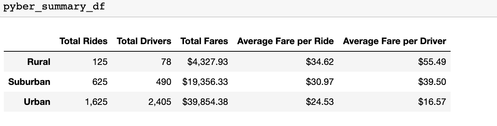
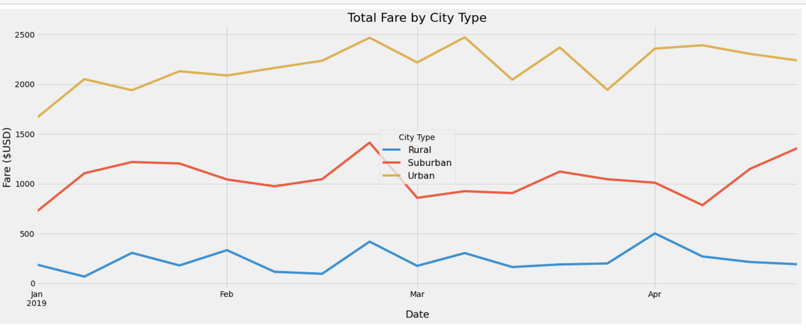

# PyBer_Analysis

## PyBer Overview

A data analyst for a ride sharing company was asked to perform exploratory analysis and create visualizations of rideshare data from January to May of 2019 to help improve access to ride-sharing services and determine affordability for underserved neighborhoods. The project required to import data from large csv files into Pandas dataframes, calculate summary statistics for total rides, total number of drivers and average fares for each city type while creating chart visualizations for the same. The challenge task aimed to use Pandas and Matplotlib and determine the following for the three city types - urban, suburban and rural:
- The total number of rides for each city type.
- The total number of drivers for each city type.
- The sum of the fares for each city type.
- The average fare per ride for each city type.
- The average fare per driver for each city type.
- Create summary dataFrame and format numbers.
- Group the data in the summary dataFrame and create a pivot table with ride dates as index  
- Resample fare data into weekly bins on the date range: 2019-01-01 through 2019-04-28
- Create a multiple-line graph that shows the total weekly fares for each city type.

## Resources

- Anaconda3_2022.05
- Conda 4.14.0
- Jupyter Notebook 6.4.8
- Python 3.7.10
- Matplotlib 3.5.1
- Numpy 1.21.5

## Results

The following were the observations noted from comparing ride-sharing data among three types of cities:

- Urban cities had 2.5 times more rides than suburban cities and 13 times more rides than rural cities.
- Urban cities had almost 5 times more drivers than suburban cities.
- Suburban cities had over 6 times more drivers and almost 4.5 times more revenue than rural cities.
- Urban cities had twice the revenue of suburban cities and 9 times more than that of rural cities.
- Rural cities had the highest average fare per ride and driver while urban cities had the lowest average fare per ride and driver.
- Usage of ridesharing services was higher in urban cities as per summary data.
  

- The total fares in rural, suburban, and urban cities between January 2019 and April 2019 plotted in the above multiline chart further support the summary data.
- The fares of urban cities show the yellow trend totalling $1600 in January 2019 to $2300 at the end of April 2019. 
- The red trends show the total fares of suburban cities fall between $700 and $1350.
- The total fare of rural cities started at $188 in January 2019 and ended at $192 in April 2019 with spikes on most weekends. 
- The trends show similar peak times for all three city types.
- The end of February 2019 showed a peak in total fares among urban, suburban, and rural cities.

## Summary

Based on the summary and trends gathered above, here are some business recommendations to Pyber for addressing disparities among the city types:
- The summary data showed that the total revenue of a city type relied on the number of rides and number of drivers. The more the rides and drivers, more  the revenue for that city type. With this in consideration, Pyber should increase the number of drivers serving rural cities.
- The costs for using Pyber services is more among riders in rural areas than urban areas. This could discourage riders from using Pyber given the higher average fare per ride.  Pyber should consolidate their ride fares in rural cities accordingly.
- The drivers in urban cities earn less than those in rural cities. This could discourage potential drivers from working with Pyber given the low average fare per driver. Pyber should consolidate their driver fares in urban cities accordingly.  

The high average fare per ride in rural cities and low average fare per driver in urban cities present an opportunity for further analyze and determine other factors that are contributing to this scenario, thereby giving Pyber a better reason to adjust their fares for rural and urban cities.

